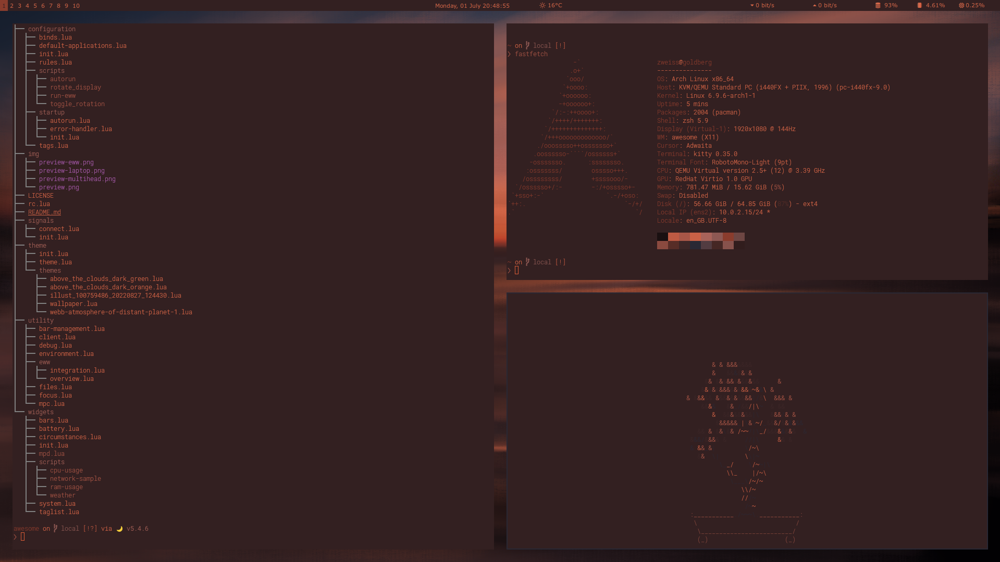
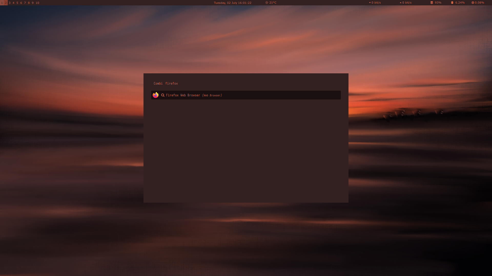
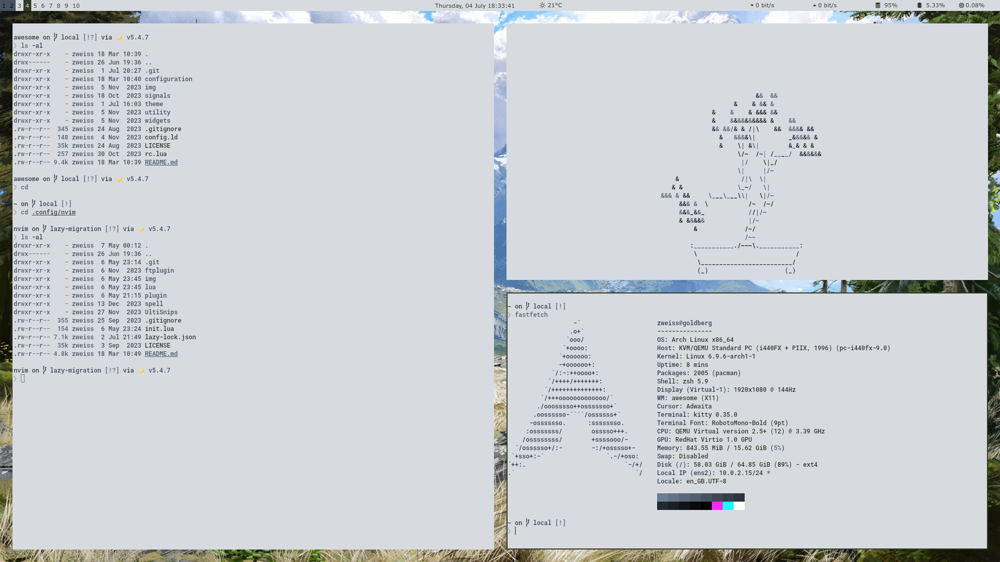
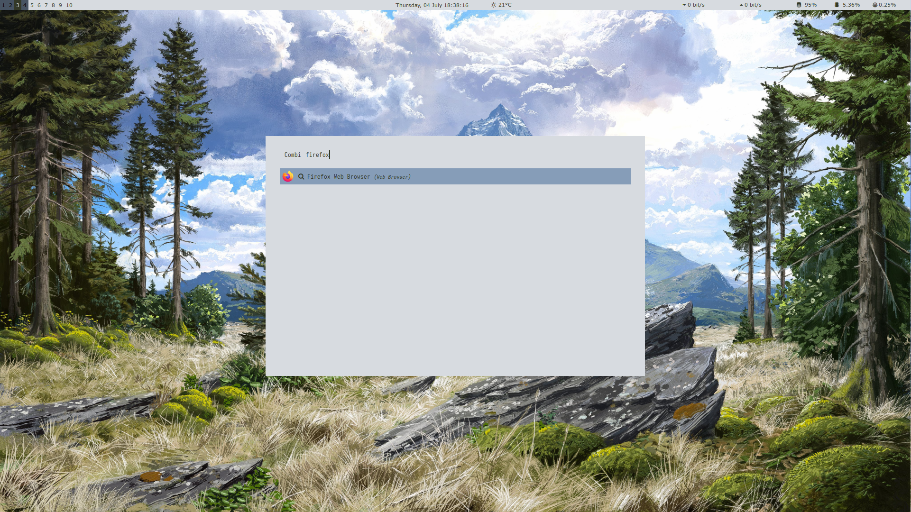

# colorgen

<div align="center">

**Effortless image-based colorscheme generation with ML-powered recommendations**

[Features](#features) •
[Installation](#installation) •
[Usage](#usage) •
[Documentation](#documentation) •
[Contributing](#contributing)

**Repository:** [Codeberg](https://codeberg.org/straightchlorine/colorgen) (primary) | [GitHub](https://github.com/straightchlorine/colorgen) (mirror)



</div>

## Features

- 🎨 **Automatic colorscheme generation** from any image
- 🔧 **Multiple target configurations**: Kitty terminal, AwesomeWM, Rofi
- 🌓 **Theme support**: Light and dark themes
- 🖥️ **TUI interface**: Interactive text-based UI for easy configuration
- 🤖 **ML-powered recommendations**: Color harmony analysis using trained models
- 🐳 **Docker support**: Run in containers for consistent environments
- 📦 **Easy installation**: Available on PyPI and as Docker image

## Installation

### From PyPI (Recommended)

```bash
pip install colorgen
```

### With Poetry

```bash
poetry add colorgen
```

### From Source

```bash
git clone https://codeberg.org/straightchlorine/colorgen.git
cd colorgen
make install
```

### Using Docker

```bash
docker pull ghcr.io/straightchlorine/colorgen:latest
```

## Usage

### CLI

```bash
# Generate colorscheme for all supported utilities
colorgen image.png --full-config --theme dark --apply

# Generate for specific utilities
colorgen image.png --config kitty awesome --theme light

# Preview without applying
colorgen image.png --config kitty --theme dark --verbose
```

### TUI (Text User Interface)

```bash
colorgen-tui
```

### Docker

```bash
# Using docker-compose
docker-compose run colorgen /images/your-image.png --config kitty

# Direct docker run
docker run -v ~/.config:/config -v $(pwd):/images ghcr.io/straightchlorine/colorgen:latest \
  /images/your-image.png --config kitty --theme dark --apply
```

### Python API

```python
from pathlib import Path
from colour.extract import Extractor
from gen.parsers.kitty import KittyGen

# Extract colors from image
extractor = Extractor(Path("image.png"), theme="dark")
palette = extractor.extract()

# Generate Kitty config
gen = KittyGen(palette, "my-theme", "dark")
gen.write()
gen.apply()  # Apply to your config
```

## Supported Configurations

| Utility | Config Path | Status |
|---------|-------------|--------|
| [Kitty](https://github.com/kovidgoyal/kitty) | `~/.config/kitty/colors/` | ✅ Supported |
| [AwesomeWM](https://github.com/awesomeWM/awesome) | `~/.config/awesome/` | ✅ Supported |
| [Rofi](https://github.com/davatorium/rofi) | `~/.config/rofi/` | ✅ Supported |

## Configuration

colorgen automatically detects configuration files and applies themes non-destructively. Previous themes are commented out, not deleted.

### Example: Kitty

Before:
```conf
# ~/.config/kitty/kitty.conf
include colors/default.conf
```

After running `colorgen image.png --config kitty --apply`:
```conf
# ~/.config/kitty/kitty.conf
#include colors/default.conf
include colors/image-dark.conf
```

## Development

### Setup

```bash
make install              # Install dependencies
make install-hooks        # Setup pre-commit hooks
```

### Testing

```bash
make test                 # Run tests with coverage
make test-verbose         # Run tests with detailed output
make quality             # Run all quality checks (lint, format, type-check, security)
```

### Code Quality

```bash
make lint                 # Check code style
make format               # Auto-format code
make type-check           # Run mypy type checking
make security             # Run security scans
```

### Building

```bash
make build                # Build Python package
make docker-build         # Build Docker image
make docs                 # Build documentation
make docs-serve           # Serve docs locally at http://localhost:8000
```

## Documentation

Full documentation is available at [colorgen.straightchlorine.org](https://colorgen.straightchlorine.org) or [GitHub Pages](https://straightchlorine.github.io/colorgen)

## Examples

### Dark Theme - Red Shades



### Light Theme - Mountain Peak



## Architecture

colorgen uses a modular parser architecture:

```
colorgen/
├── colour/              # Color extraction and management
│   ├── colour.py        # Colour class
│   └── extract.py       # Image processing
├── gen/                 # Configuration generators
│   ├── gen.py           # Base ConfigGen class
│   └── parsers/         # Target-specific parsers
│       ├── kitty.py
│       ├── awesome.py
│       └── rofi.py
└── tui/                 # Text user interface (coming soon)
```

## Roadmap

- [x] CLI interface with comprehensive testing
- [x] Docker support
- [x] CI/CD with Woodpecker CI 
- [x] PyPI packaging
- [ ] TUI with Textual
- [ ] ML-powered color harmony recommendations
- [ ] Wayland compositor support (Hyprland, Sway)
- [ ] GTK theme generation
- [ ] Theme switching via Rofi applet
- [ ] Web preview interface

## License

GPL-3.0-or-later - see [LICENSE](LICENSE) for details

## Author

**Piotr Krzysztof Lis**
- Codeberg: [@straightchlorine](https://codeberg.org/straightchlorine)
- GitHub: [@straightchlorine](https://github.com/straightchlorine) (mirror)
- Email: piotr@codextechnologies.org

## Acknowledgments

- [Pylette](https://github.com/qTipTip/Pylette) for color extraction
- [Textual](https://github.com/Textualize/textual) for TUI framework
