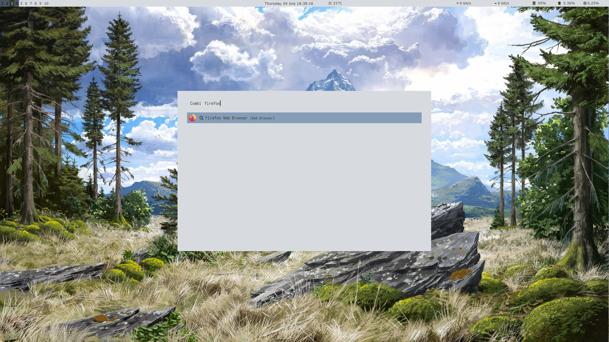

<h3 align="center">colorgen</h3>

  <p align="center">Effortless image based colorscheme generation.
    <br />
    <br />
    <a href="https://github.com/straightchlorine/awesomewm-basileia/issues">Report Bug</a>
  </p>
</div>

### Features
* Generating ready to use matching colorschemes for [kitty](https://github.com/kovidgoyal/kitty), [AwesomeWM](https://github.com/awesomeWM/awesome) and [Rofi](https://github.com/davatorium/rofi);
* Automatic configuration updates - quick restart settles everything.


## Usage
```
$$ ./colorgen.py -h
usage: colorgen.py [-h] [--config {kitty,awesome,rofi} [{kitty,awesome,rofi} ...] | --full-config] [--theme {dark,light}] [--verbose] [--apply] image

Creates a colorscheme based on an image and creates an colour files for given utilities.

positional arguments:
  image                 Path to the image file

options:
  -h, --help            show this help message and exit
  --config {kitty,awesome,rofi} [{kitty,awesome,rofi} ...], -c {kitty,awesome,rofi} [{kitty,awesome,rofi} ...]
                        Generate config for a given utilities
  --full-config, -fc    Generatre config for every single offered utility
  --theme {dark,light}, -t {dark,light}
                        Choose the theme: dark or light
  --verbose, -v         Enable verbose output
  --apply, -a           Replace existing colorscheme

Author: Piotr Krzysztof Lis - github.com/straightchlorine
```
**Important Note:** Configuration files change **only** when `-a`(`--apply`) option is provided as an argument, so
**consider backing up your configuration files before running `-a` option.**

The configuration was tested only on a modularised configuration, with relatively small files. Thus, if 
it would be wise to use this option with caution in case your particular configuration is not handled by the application appropriately.

By adjusting `_edit_section()` of a parser you can customise its behaviour.

Currently, there are three utilities, for which the software can offer configurations:

* [kitty](https://github.com/kovidgoyal/kitty)
* [AwesomeWM](https://github.com/awesomeWM/awesome)
* [Rofi](https://github.com/davatorium/rofi)

Just those three can give a great visual experience:





Plans for the future consist of, at the very least, adding a parser for one of the tiling managers for Wayland.

### Development

Configuration generation depends on the utility dedicated parsers within `gen/parsers` folder. Each of them
provides logic required to properly handle past themes, which stay within the file, and adding
new ones. Each parser is a subclass of `ConfigGen` from `gen.gen`, thanks to that amount of work
required to create a new parser is pretty tiny.

### Plans

* [ ] add nice parser for Wayland window manager
* [ ] do something with GTK so that thunar/nautilus will look good
* [ ] switching themes (maybe via rofi applet)
